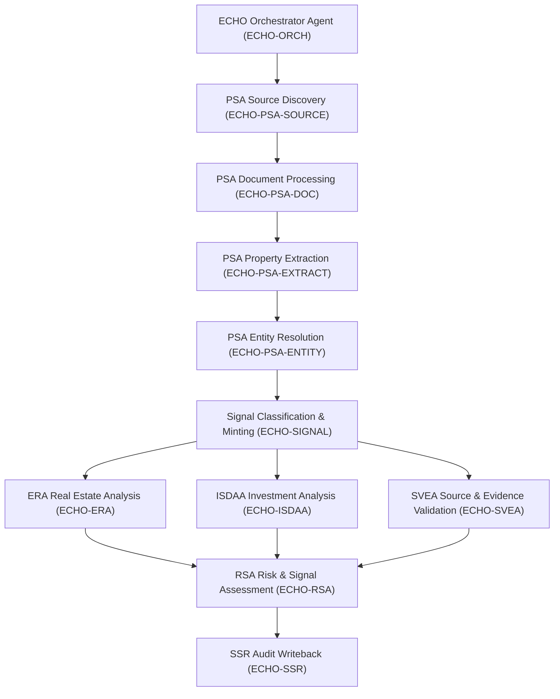

# ECHO — Multi-Agent Financial & Real-Estate Intelligence System

ECHO is an AI-powered financial and real-estate intelligence platform engineered to transform fragmented real-estate and financial information into structured, explainable, and traceable intelligence.

Rather than operating as a monolithic chatbot, ECHO functions as a coordinated intelligence pipeline composed of 11 specialized, modular agents executing with complete provenance, transparent formulas, and immutable audit history.

---

## 1. Architectural Philosophy

ECHO adheres strictly to foundational engineering principles:

- **Modularity**: Each agent possesses exactly one unambiguous responsibility.
- **Traceability & Lineage**: Every data point is traceable back to its underlying evidentiary source:
  $$\text{SOURCE} \longrightarrow \text{DOCUMENT} \longrightarrow \text{EXTRACTED DATA} \longrightarrow \text{CANONICAL ENTITY} \longrightarrow \text{SIGNAL} \longrightarrow \text{ANALYSIS} \longrightarrow \text{RISK} \longrightarrow \text{SSR}$$
- **Provenance**: Records preserve source identifiers, timestamps, retrieved dates, acting agent IDs, agent versions, and execution run IDs.
- **Explainability**: Calculations and risk evaluations expose transparent logic ($\text{INPUT} \rightarrow \text{FORMULA} \rightarrow \text{ASSUMPTION} \rightarrow \text{RESULT}$) rather than fabricating magic numbers.
- **Reproducibility**: Deterministic identifiers (hashes) prevent duplicate signal minting and enable reproducible entity deduplication.
- **Separation of Concerns**: Strict boundary isolation between API routes, orchestration, agents, service logic, database ORM models, schemas, and ML interfaces.
- **Truthful Status Reporting**: Placeholders and missing market metrics return structured status codes (`NOT_IMPLEMENTED`, `NOT_CALCULATED`, `PARTIAL_SUCCESS`) rather than faked values.

---

## 2. The 11 ECHO Primary Agents

| No. | Agent Name | Agent ID | Version | Primary Responsibility |
|:---:|:---|:---:|:---:|:---|
| **01** | **ECHO Orchestrator Agent** | `ECHO-ORCH` | `0.1.0` | Coordinates agent pipelines, dispatches tasks, tracks execution runs, manages retries, and compiles final `InvestigationResult`. |
| **02** | **PSA Source Discovery & Collection Agent** | `ECHO-PSA-SOURCE` | `0.1.0` | Discovers and registers raw sources across Web, API, Browser, and File adapters. |
| **03** | **PSA Document Processing Agent** | `ECHO-PSA-DOC` | `0.1.0` | Normalizes and segments raw HTML, text, and documents into machine-readable documents and atomic chunks. |
| **04** | **PSA Property Extraction & Normalization Agent** | `ECHO-PSA-EXTRACT` | `0.1.0` | Extracts structured property attributes (financials, location, specs, regulatory) and links verbatim evidence snippets. |
| **05** | **PSA Entity Resolution & Deduplication Agent** | `ECHO-PSA-ENTITY` | `0.1.0` | Resolves multiple listings into canonical entities, deduplicates records, and calculates explainable match confidence. |
| **06** | **Signal Classification & Signal Minting Agent** | `ECHO-SIGNAL` | `0.1.0` | Detects and mints deterministic signals (`PRICE_DROP`, `LISTING_NEW`, etc.) without fabricating unverified events. |
| **07** | **ERA — Real Estate Analysis Agent** | `ECHO-ERA` | `0.1.0` | Computes valuations (price/sqft, rental yield) while explicitly exposing input sources and calculation assumptions. |
| **08** | **ISDAA — Investment & Scenario Decision Analysis Agent** | `ECHO-ISDAA` | `0.1.0` | Models investment scenarios (`BASE`, `CONSERVATIVE`, `OPTIMISTIC`), exposing cash flows, yields, and ROI formulas. |
| **09** | **SVEA — Source & Evidence Validation Agent** | `ECHO-SVEA` | `0.1.0` | Cross-validates source evidence, assesses freshness, and captures discrepancies in structured `ConflictRecord`s. |
| **10** | **RSA — Risk & Signal Assessment Agent** | `ECHO-RSA` | `0.1.0` | Assesses risk factors (Data Quality, Regulatory, Price, Market) with documented reasons and evidence linkages. |
| **11** | **SSR — Structured Signal Record / Audit Writeback Agent** | `ECHO-SSR` | `0.1.0` | Persists verified intelligence to database, maintains versioned entities, and logs historical mutations (`HistoricalChangeRecord`). |

---

## 3. Agent Dependency Graph



> [!NOTE]
> The dependency graph is conceptual. The orchestrator dynamically evaluates `WorkflowType` configurations, executing targeted sub-pipelines rather than forcing every request through every agent.

---

## 4. Supported Investigation Workflows

1. **`PROPERTY_DISCOVERY`**: `SOURCE` $\rightarrow$ `DOC` $\rightarrow$ `EXTRACT` $\rightarrow$ `ENTITY` $\rightarrow$ `SVEA` $\rightarrow$ `SSR`
2. **`PROPERTY_ANALYSIS`**: `EXTRACT` $\rightarrow$ `ENTITY` $\rightarrow$ `ERA` $\rightarrow$ `SVEA` $\rightarrow$ `RSA` $\rightarrow$ `SSR`
3. **`INVESTMENT_ANALYSIS`**: `ERA` $\rightarrow$ `ISDAA` $\rightarrow$ `SVEA` $\rightarrow$ `RSA` $\rightarrow$ `SSR`
4. **`SIGNAL_ANALYSIS`**: `SOURCE` $\rightarrow$ `DOC` $\rightarrow$ `EXTRACT` $\rightarrow$ `SIGNAL` $\rightarrow$ `SVEA` $\rightarrow$ `RSA` $\rightarrow$ `SSR`
5. **`RISK_ANALYSIS`**: `SVEA` $\rightarrow$ `RSA` $\rightarrow$ `SSR`
6. **`FULL_ANALYSIS`**: Executes all 10 specialized agents end-to-end.

---

## 5. Directory Structure

```
backend/
├── app/
│   ├── main.py                        # FastAPI application entry point & lifecycle
│   ├── api/
│   │   ├── __init__.py
│   │   └── routes/
│   │       ├── __init__.py            # API router aggregator
│   │       ├── health.py              # GET /health
│   │       ├── agents.py              # GET /agents, GET /agents/{id}
│   │       └── investigations.py      # POST /investigations, GET /investigations/{run_id}
│   ├── agents/
│   │   ├── __init__.py                # Package init & auto-registration
│   │   ├── base_agent.py              # Abstract BaseAgent class
│   │   ├── registry.py                # AgentRegistry singleton
│   │   ├── orchestrator_agent.py      # Agent 01: EchoOrchestratorAgent
│   │   ├── psa/
│   │   │   ├── __init__.py
│   │   │   ├── source_discovery_agent.py     # Agent 02: PsaSourceDiscoveryAgent
│   │   │   ├── document_processing_agent.py  # Agent 03: PsaDocumentProcessingAgent
│   │   │   ├── property_extraction_agent.py  # Agent 04: PsaPropertyExtractionAgent
│   │   │   └── entity_resolution_agent.py    # Agent 05: PsaEntityResolutionAgent
│   │   ├── signal_agent.py            # Agent 06: SignalAgent
│   │   ├── era_agent.py               # Agent 07: EraAgent
│   │   ├── isdaa_agent.py             # Agent 08: IsdaaAgent
│   │   ├── svea_agent.py              # Agent 09: SveaAgent
│   │   ├── rsa_agent.py               # Agent 10: RsaAgent
│   │   └── ssr_agent.py               # Agent 11: SsrAgent
│   ├── schemas/                       # Pydantic schemas (contracts & models)
│   │   ├── __init__.py
│   │   ├── agent.py                   # AgentRequest, AgentResult, AgentRun
│   │   ├── investigation.py           # InvestigationRequest, InvestigationResult
│   │   ├── property.py                # PropertyCandidate, PropertyRecord, specs
│   │   ├── source.py                  # SourceRecord, SourceType
│   │   ├── evidence.py                # EvidenceRecord, DocumentRecord, ProvenanceRecord
│   │   ├── signal.py                  # Signal, SignalType, SignalSeverity
│   │   ├── analysis.py                # RealEstateAnalysis, AnalysisMetric
│   │   ├── investment.py              # InvestmentScenario, InvestmentAnalysis
│   │   ├── risk.py                    # RiskAssessment, RiskFactor, RiskDimension
│   │   ├── validation.py              # ValidationResult, ConflictRecord
│   │   └── audit.py                   # AuditRecord, HistoricalChangeRecord
│   ├── services/                      # Business services mediating API & agents
│   │   ├── __init__.py
│   │   ├── agent_service.py           # Agent inspection & direct execution
│   │   ├── investigation_service.py   # Investigation lifecycle & persistence
│   │   └── provenance_service.py      # Lineage tracing & evidentiary lookup
│   ├── database/                      # SQLAlchemy persistence layer
│   │   ├── __init__.py
│   │   ├── connection.py              # Engine, SessionLocal, get_db, init_db
│   │   └── models.py                  # ORM models (Property, Source, Signal, etc.)
│   ├── core/                          # Settings and structured logging
│   │   ├── __init__.py
│   │   ├── config.py                  # Pydantic BaseSettings (.env loading)
│   │   └── logging.py                 # Structured JSON logging & agent event logs
│   ├── integrations/                  # Abstract adapter interfaces for external services
│   │   ├── __init__.py
│   │   └── adapters.py                # Scraping, LLM, Embedding, Geocoding interfaces
│   ├── ml/                            # Abstract interfaces for AI/ML models
│   │   ├── __init__.py
│   │   └── interfaces.py              # ExtractionModel, ClassificationModel, RiskModel
│   └── utils/                         # Helper utilities
│       ├── __init__.py
│       ├── ids.py                     # Deterministic & UUID generator functions
│       ├── timestamps.py              # ISO-8601 UTC timestamp utilities
│       └── serialization.py           # JSON serialization helpers
├── tests/                             # Automated test suite (Pytest)
│   ├── __init__.py
│   ├── agents/                        # Unit tests for all 11 agents
│   ├── api/                           # Endpoint tests (Health, Agents, Investigations)
│   ├── schemas/                       # Pydantic schema validation tests
│   └── fixtures/
│       └── sample_property.json       # Clearly marked test fixture
├── requirements.txt                   # Production backend dependencies
├── .env.example                       # Environment configuration template
└── README.md                          # Architecture & operations documentation
```

---

## 6. How to Run the Backend

### Prerequisites
- Python 3.11+ (verified on Python 3.13.7)

### Installation
From the project root:
```powershell
python -m pip install -r backend/requirements.txt
```

### Starting the Server
Run uvicorn pointing to the FastAPI app:
```powershell
python -m uvicorn backend.app.main:app --host 0.0.0.0 --port 8000 --reload
```
Once started, access the interactive API docs at:
- Swagger UI: `http://localhost:8000/docs`
- ReDoc: `http://localhost:8000/redoc`

---

## 7. How to Run Tests

Execute the complete pytest suite:
```powershell
python -m pytest backend/tests -v
```

All 42 tests cover:
- Instantiation and BaseAgent inheritance for all 11 agents
- Unique agent IDs and semantic versions (`0.1.0`)
- Input contract validation and error handling
- Standardized `AgentResult` structures
- Agent registration in `AgentRegistry`
- Orchestrator multi-stage workflow execution
- Schema constraints and deterministic ID generation
- FastAPI endpoints (`GET /health`, `GET /agents`, `POST /investigations`, `GET /investigations/{run_id}`)

---

## 8. Environment Variables

Copy `.env.example` to `.env` in `backend/`:
```env
# Database (Default: SQLite local; PostgreSQL compatible)
DATABASE_URL=sqlite:///./echo_backend.db

# Message Broker / Cache (Future integration)
REDIS_URL=

# AI / LLM Providers (Future integration)
OPENAI_API_KEY=
LLM_PROVIDER=

# Vector Database (Future integration)
VECTOR_DB_URL=

# External Data Services (Future integration)
GEOCODING_API_KEY=
SCRAPER_API_KEY=

# Application Environment
ENVIRONMENT=development
LOG_LEVEL=INFO
DEBUG=false
```

---

## 9. Extending & Replacing Agents

### How to Add a New Agent
1. Create your agent module under `backend/app/agents/` inheriting from `BaseAgent`:
   ```python
   from backend.app.agents.base_agent import BaseAgent
   from backend.app.schemas.agent import AgentRequest, AgentResult, AgentExecutionStatus

   class CustomAnalysisAgent(BaseAgent):
       agent_id: str = "ECHO-CUSTOM"
       name: str = "Custom Analysis Agent"
       version: str = "0.1.0"
       description: str = "Performs specialized analytics."
       capabilities: list[str] = ["custom_analytics"]

       def _run(self, request: AgentRequest) -> AgentResult:
           # Implement business logic here
           return AgentResult(
               success=True,
               status=AgentExecutionStatus.SUCCESS,
               agent_id=self.agent_id,
               run_id=request.run_id,
               data={"metric": 100},
           )
   ```
2. Register the agent in `backend/app/agents/__init__.py`:
   ```python
   registry.register(CustomAnalysisAgent)
   ```
3. Add the agent ID to `WORKFLOW_PIPELINES` in `orchestrator_agent.py` if part of orchestrated workflows.

### How to Replace an Agent Implementation
Because each agent adheres strictly to the `BaseAgent` interface and exchanges typed Pydantic payloads (`AgentRequest` and `AgentResult`), any agent can be refactored or replaced (e.g., swapping `RuleBasedPropertyExtractor` with `LlmPropertyExtractor`) without affecting any other pipeline stage.

---

## 10. Provenance & Audit Model

When data flows through ECHO, the provenance record captures:
- `source_id`: Originating source identifier
- `source_url`: URL of origin
- `retrieved_at`: Exact timestamp of acquisition
- `agent_id`: Agent that produced or modified the record
- `agent_version`: Semantic version of executing code
- `run_id`: Pipeline investigation run ID
- `evidence_id`: Factual atomic excerpt backing the data point

If an attribute shifts (e.g., price changes from 1.20 Cr to 1.25 Cr), the `SsrAgent` commits a `HistoricalChangeRecord` preserving `old_value`, `new_value`, `changed_at`, and `signal_id`, preventing silent historical data overwrites.

---

## 11. Error Handling Architecture

Broad, silent exception suppression is strictly prohibited. Every agent encapsulates execution in a protected lifecycle:
1. `validate_input()` ensures structural preconditions are satisfied.
2. `try ... except Exception as exc` catches unhandled exceptions, logs full stack traces via structured logger, and returns an `AgentResult` with `status=AgentExecutionStatus.FAILED` and explicit `errors`.
3. The Orchestrator monitors status codes (`SUCCESS`, `PARTIAL_SUCCESS`, `FAILED`, `SKIPPED`, `NOT_IMPLEMENTED`) and makes deterministic retry, skip, or fallback decisions.
